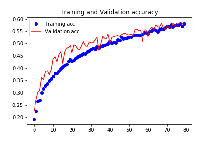
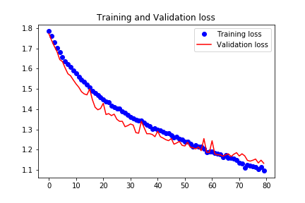
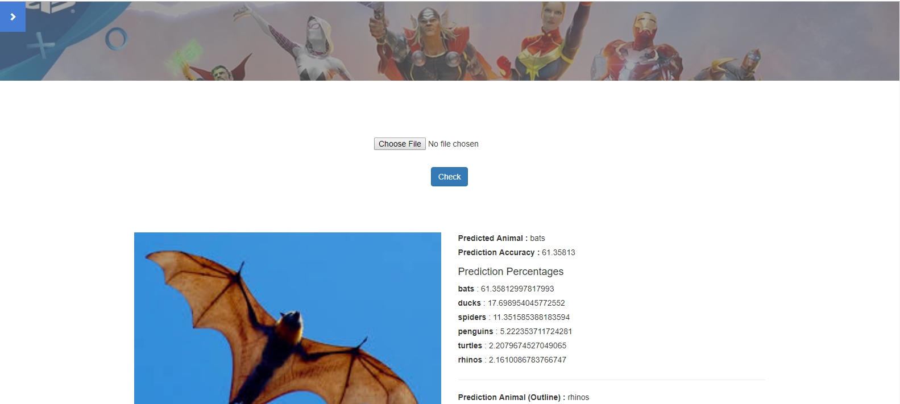

# The Little CNN That Could: Small Machine Learning CNN with Small Dataset
Designed and developed CNN model to recognize challenging animal images by training small data set. I designed the CNN model by referring to following megaphone shapes to see which one actually predicted the correct animal image. Also used wireframe images to see if the predictions would improve. Found that the applying the final megaphone shape shown on the jupyter notebook had the greatest effect on prediction outcomes. Please refer to https://github.com/paul-data-science/Deep_Learning_CNN/blob/master/superhero_classifier_presentation_by_PaulAg.ipynb
 

#Heroku APP
https://ruds-finalproject.herokuapp.com/

